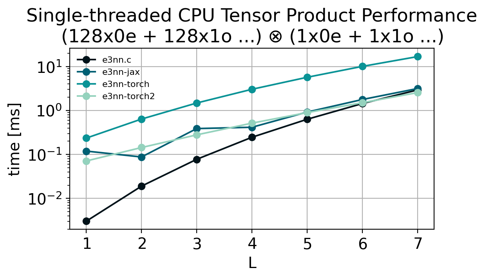
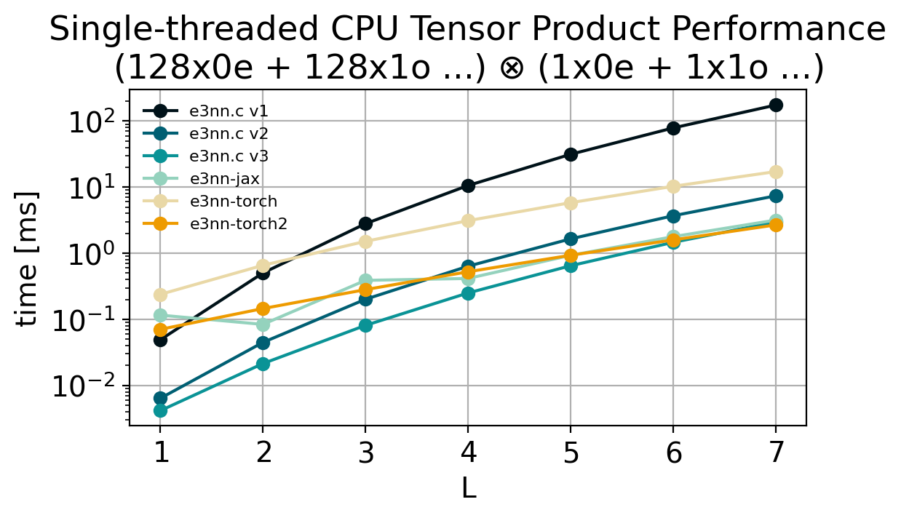

# e3nn.c

Pure C implementation of [`e3nn`](https://e3nn.org/). Mostly done for pedagogical reasons, but similar code could be used for C/C++ implementations of e3nn-based models for inference or CUDA kernels for faster operations within Python libraries.

Currently the only operations implemented are the tensor product, and spherical harmonics. 



*Single-thread CPU performance of the tensor product on an Intel i5 Desktop Processor.*

## Message Computation

```c
// message_example.c
#include <stdio.h>

#include "e3nn.h"

 int main(void){

     float node_position_sh[9] = {0};
     spherical_harmonics("1x0e + 1x1o + 1x2e", 1, 2, 3, node_position_sh);

     printf("sh ["); for (int i = 0; i < 9; i++){ printf("%.2f, ", node_position_sh[i]); } printf("]\n");

     float neighbor_feature[] = {7,8,9};
     float product[27] = { 0 };
     tensor_product("1x0e + 1x1o + 1x2e", node_position_sh, 
                    "1x1e", neighbor_feature, 
                    "1x0o + 1x1o + 2x1e + 1x2e + 1x2o + 1x3e", product);
     printf("product ["); for (int i = 0; i < 27; i++){ printf("%.2f, ", product[i]); } printf("]\n");

     float weights[] = {1, 2, 3, 4, 5, 6, 7, 8, 9};
     ///               [ 1 x 1 weight] [1 x 1 weight] [2 x 2 weight] [1 x 1 weight] [1 x 1 weight] [ 1 x 1 weight]
     float output[27] = { 0 };
     linear("1x0o + 1x1o + 2x1e + 1x2e + 1x2o + 1x3e",
            product,
            weights,
            "1x0o + 1x1o + 2x1e + 1x2e + 1x2o + 1x3e",
            output);

     printf("output ["); for (int i = 0; i < 27; i++) { printf("%.2f, ", output[i]); } printf("]\n");

     return 0;
 }
```

```shell
$ make message_example && ./message_example
sh [1.00, 0.46, 0.93, 1.39, 0.83, 0.55, -0.16, 1.66, 1.11, ]
product [13.36, -1.96, 3.93, -1.96, 7.00, 8.00, 9.00, 2.63, 9.50, 16.36, -2.71, 0.00, 4.69, 2.71, -1.36, 9.82, 7.20, -0.38, 13.75, 6.55, 10.76, 13.42, 2.58, -9.40, 5.91, 11.50, 2.93, ]
output [13.36, -3.93, 7.86, -3.93, 24.13, 50.54, 76.95, 30.94, 62.91, 94.88, -18.97, 0.00, 32.86, 18.97, -9.49, 78.56, 57.61, -3.02, 109.98, 52.37, 96.83, 120.75, 23.18, -84.62, 53.18, 103.50, 26.41, ]
```

Writes the same values to buffer `output` as the following Python code:

```python
import jax.numpy as jnp
import e3nn_jax as e3nn

# Computed message (for e.g. force) between two atoms

node_position = jnp.asarray([1,2,3])
node_position_sh = e3nn.spherical_harmonics("1x0e + 1x1o + 1x2e", node_position, normalize=True, normalization="component")
print("sph", node_position_sh.array)

neighbor_feature = e3nn.IrrepsArray("1x1e", jnp.asarray([7,8,9]))
tp = e3nn.tensor_product(node_position_sh, neighbor_feature)
print("product", tp.array)
linear = e3nn.flax.Linear("1x0o + 1x1o + 2x1e + 1x2e + 1x2o + 1x3e",
                          "1x0o + 1x1o + 2x1e + 1x2e + 1x2o + 1x3e")
weights = {'params': {'w[0,0] 1x0o,1x0o': jnp.asarray([[1]]),
                      'w[1,1] 1x1o,1x1o': jnp.asarray([[2]]),
                      'w[2,2] 2x1e,2x1e': jnp.asarray([[3 , 4], [ 5,  6]]),
                      'w[3,3] 1x2e,1x2e': jnp.asarray([[7]]),
                      'w[4,4] 1x2o,1x2o': jnp.asarray([[8]]),
                      'w[5,5] 1x3e,1x3e': jnp.asarray([[9]])}}
message = linear.apply(weights, tp)
print("output",message.array)
```

## Usage

See example above and in `message_example.c`. Run with

```bash
make message_example
./message_example
```

Currently the output irrep must be defined manually. This could be computed on the fly with minimal computational cost, however I am not sure what makes for the best API here. Additionally, only `component` normalization is currently implemented, and it will not function properly if the output irreps do not match the full simplified output irreps (i.e. no filtering); see [Todo](#todo).

## Benchmarking

```bash
python -m ./venv
source venv/bin/activate
pip install -r extra/requirements.txt

make benchmark
```



`e3nn.c` contains several tensor product implementations, each with improvements over the previous for faster runtime.

### `v1`

`tensor_product_v1` Is a naive implementation that performs the entire tensor product for all Clebsch-Gordan coefficients:

```math
(u \otimes v)^{(l)}_m = \sum_{m_1 = -l_1}^{l_1}\sum_{m_2 = -l_2}^{l_2} C^{(l, m)}_{(l_1, m_1)(l_2, m_2)} u^{(l_1)}_{m_1}v^{(l_2)}_{m_2}
```

To minize overhead in the computation of the Clebsch-Gordan coefficients, they are pre-computed up to `L_MAX` and cached the first time the tensor product is called, creating a one-time startup cost.

### `v2`

The `tensor_product_v2` implementation leverages the fact that, even after conversion to the real basis, the Clebsch-Gordan coeffecients are generally sparse, with many entries equal to 0. To take advantage of this, we precompute a data structure that stores only the non-zero entries of $C$ at each $l_1$, $l_2$, $l$ and their corresponding index at $m_1$, $m_2$, $m$. This significantly improves performance by elminating needless operations of iterating through 0 valued coefficients. Just-in-time (JIT) compilers built into JAX and PyTorch are likely able to perform this optimization as well.

### `v3`

`tensor_product_v3` forgoes the computation of Clebsch-Gordan coefficients all together, and instead generates C code to compute the partial tensor product at every $l_1$, $l_2$, $l$ combination up to `L_MAX`. This elimates the need to iterate over any coefficients, allowing each value in the output to be written in a single step. As it as generated at compile time, the C compliler can also make optimizations to ensure the operations are fast. See `tp_codegen.py`, which generates `tp.c`, containing all of the tensor product paths.

## Todo:

 - [X] Benchmark against `e3nn` and `e3nn-jax`
 - [X] Sparse Clebsch-Gordan implementation
 - [X] Implement Spherical Harmonics
 - [X] Implement Linear/Self-interaction operation
 - [ ] Implement `filter_ir_out` and `irrep_normalization="norm"` for tensor product
 - [ ] Full [Nequip](https://arxiv.org/abs/2101.03164), [Allegro](https://arxiv.org/abs/2204.05249), or [ChargE3Net](https://arxiv.org/abs/2312.05388) implementation
 - [ ] Implement `integral`, `norm`, and no normalization for spherical harmonics
 - [ ] ...

## See also

 * [`e3nn` PyTorch]()
 * [`e3nn-jax`](https://github.com/e3nn/e3nn-jax)
 * The `e3nn` paper: https://arxiv.org/abs/2207.09453
 * *Numerical Recipes in C, 2nd Edition* ([Press et al.](http://s3.amazonaws.com/nrbook.com/book_C210.html)) - helpful formulae and reference implementations for Legendre polynomials, Bessel functions
 * [karpathy/llama.c](https://github.com/karpathy/llama2.c) - inspo for work
